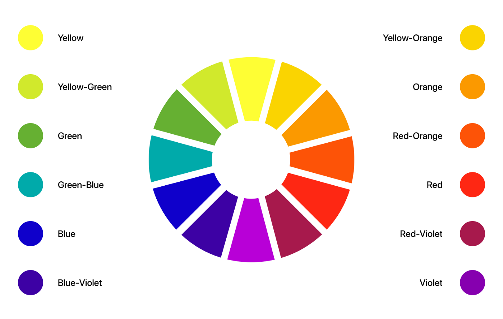
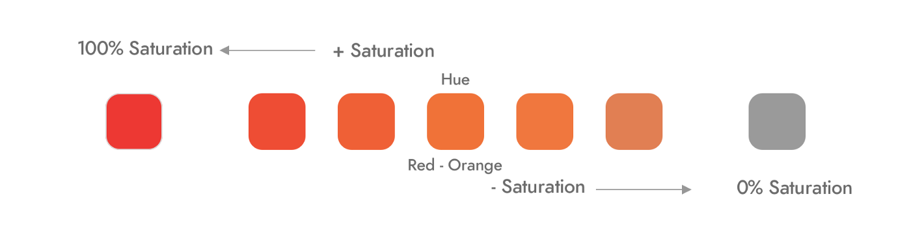
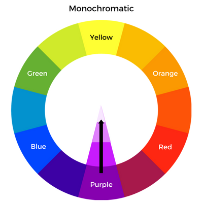
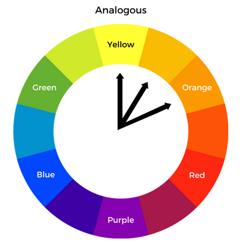
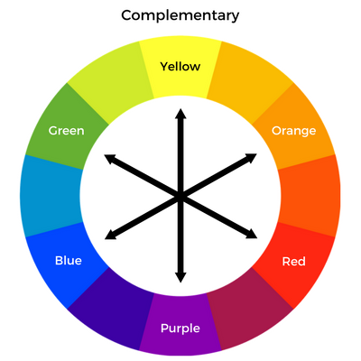
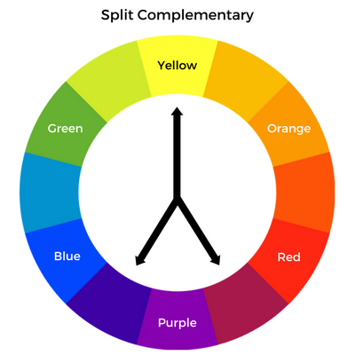
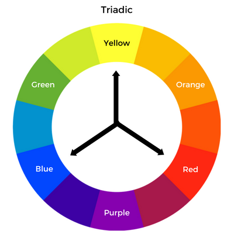
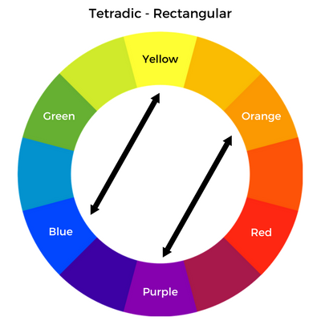

```{r setup, include=FALSE}
knitr::opts_chunk$set(echo = FALSE)
```

Recently, I've been doing a lot of research about color. Color is an important element of all visualizations and it is a powerful communication tool. For this reason, I try to utilize color in my data visualizations in order to improve the clarity of my message and the quality of my data stories.

The topic of color is VAST, and there are many different resources on the topic. There are podcasts, books, YouTube videos, blog posts, Twitter threads, and the list goes on. What initially sparked my interest in color was a [Data Stories podcast with Karen Schloss](https://datastori.es/119-color-with-karen-schloss/), who conducts research on the effective uses of color in visualization and everyday tasks at her [lab](https://schlosslab.discovery.wisc.edu/) at the University of Wisconsin-Madison. I encourage you to go give it a listen if you haven't yet already.

Because this is such a huge topic, I'm going to break it down into a series of different posts. To start, let's define some key terms relating to color and then do a brief introduction into color theory and color harmonies.

## Key Terminology  
*(all images in this section courtesy of https://www.qed42.com/blog/from-hue-to-color-story-a-basic-understanding-of-colors)*

### Hue
**Hue** is what we typically think of as color - "red", "blue-green", "purple", etc.
  



### Saturation
**Saturation** is interchangeable with **intensity** - this references to how subtle or vibrant a color is.



### Value
**Value** is how light (white) or dark (black) a color is. Darker versions of a hue are called **shades** and lighter versions of a hue are called **tints**. 


## Color Theory and Color Harmonies
*(all color wheel images in this section courtesy of https://blog.thepapermillstore.com/color-theory-color-harmonies/)*

The definition for **color theory** on Wikipedia describes it as: *a body of practical guidance to color mixing and the visual effects of a specific color combination*. What we'll be focusing on is the different types of color combinations. These color schemes are referred to as **color harmonies**. We can utilize certain color harmonies to create visualizations that are pleasing to the eye. There are 6 main types of color harmonies:  


### Monochromatic

One of the easiest color schemes to create. All you have to do is pick a hue, then change saturation and value to make different color variations. The best part of this color scheme is that it's guaranteed to match! Monochromatic color schemes are best used for continuous color scales in visualizations such as heat maps and choropleth maps.


### Analagous

This is also another easy color scheme to create. An analogous color palette contains hues that are right next to each other on the color wheel. Analogous colors can also be used in heat maps and choropleth maps, but also can be used with categorical data.

### Complementary

A complementary color scheme uses colors that are across from each other on the color wheel. To avoid a basic color scheme, use a variation of lighter, darker, or desaturated tones to build a palette.

### Split-Complementary

To create a split-complementary color scheme, first choose one color, find its complement, and then choose colors that are on either side of that complement. Like the complementary color scheme, you can also introduce variations of lightness, darkness, and saturation to create a more complex palette.

### Triadic

A triadic color scheme uses 3 colors that are evenly spaced on the color wheel. Keep in mind that these combinations tend to be pretty striking, especially if you're using all primary or all secondary colors.

### Tetradic

Tetradic color schemes form either a square or a rectangle on the color wheel. This can result in a lot of hues, so it is not the most-recommended way to build a color palette for a data visual. This type of color scheme is best used when one color is dominating and the rest are used as accents.

