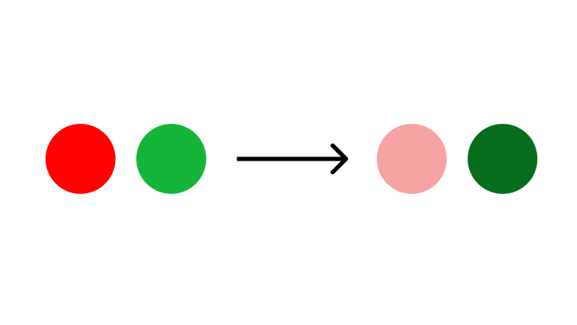
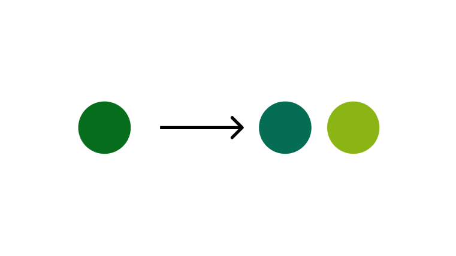
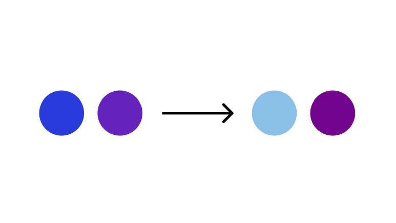
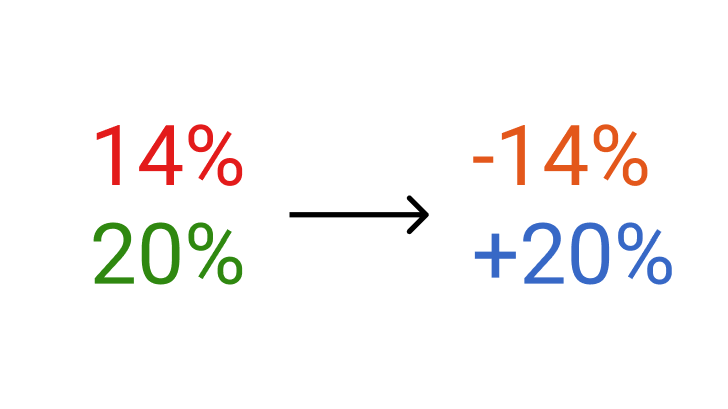
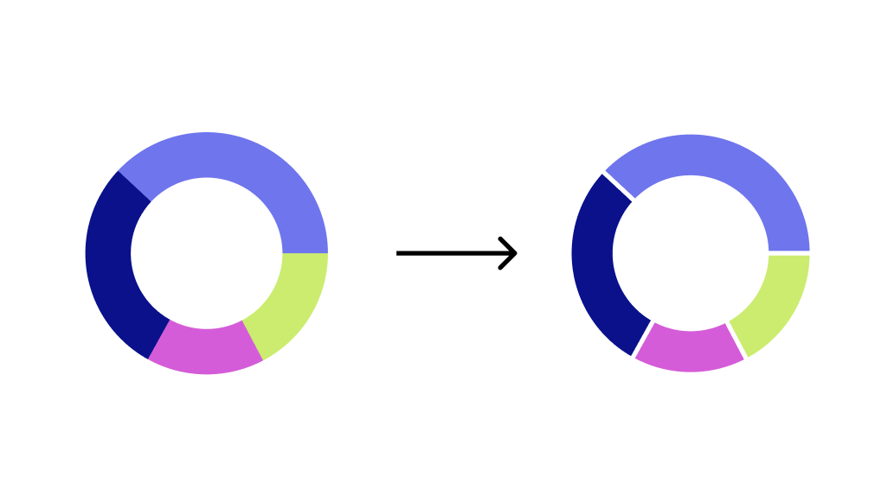

```{r setup, include=FALSE}
knitr::opts_chunk$set(echo = FALSE)
```
# Introduction
When choosing colors for a color visualization, it is important to be mindful of those with color vision deficiencies. **Color vision deficiency** is the inability to distinguish certain shades of color; the term "color blindness" is also used to describe this condition, but very few people are completely colorblind (*American Optometric Association*). 
  
Color deficiency is the result of malfunctioning or missing cones in the eyes - cones being the part of the eye that perceives color. Without getting too technical, our eyes have three cones - red, green, and blue. The most common type of deficiencies make it hard to differentiate between red and green. 

There are four main types of red-green color deficiencies, listed below with their corresponding prevalence sourced from [We are Colorblind](https://wearecolorblind.com/articles/a-quick-introduction-to-color-blindness/):  
● **Deuteranomaly (4.63%)** - malfunctioning green cone  
● **Deuteranopia (1.27%)** - missing green cone  
● **Protanomaly (1.08%)** - malfunctioning red cone  
● **Protanopia (1.01%)** - missing red cone  

There are also two types of blue color deficiency, but they are very rare:  
● **Tritanopia (0.03%)** - missing blue cone  
● **Tritanomaly (0.02%)** - malfunctioning blue cone  


There are many tools that you can use to simulate these color deficiencies on your color palettes. My personal favorite is [Viz Palette by Elijah Meeks & Susie Lu](https://projects.susielu.com/viz-palette). But there are others out there such as [COBLIS](https://www.color-blindness.com/coblis-color-blindness-simulator/) and [Color Oracle](https://colororacle.org/).

Besides checking your palette under a simulator (which you should always do), here are some other ways that you can improve the accessibility of your color palettes:


## 1. Have Lightness Contrast
Having lightness contrast is one of the best ways to improve the perception of a color palette.



## 2. If using green, make it a bit yellow or a bit blue
By adjusting the hue of a green color, you can make it more perceivable to those who have color deficiencies.



## 3. Avoid using too many shades of purple and blue together
Purple is my favorite color so I often want to use it in my visualizations and what I’ve learned from using colorblindness simulators is that it is often perceived as a shade of blue, so just use caution when using these two colors together. Again, lightness contrast is a way to resolve this issue.



## 4. Don't use red and green together
This may seem like an obvious tip for anyone remotely familiar with color deficiencies, but it can be a natural instinct to use these colors in a divergent palette to represent positive or negative values. Instead, try to use orange and blue and/or denote the increases with +/- symbols.



## 5. Use border or white space between colored areas
By utilizing borders or white space, you can preserve contrast between colors/areas of your visualization.




# Conclusion
Checking that your visualization is perceivable by those with color deficiencies is only ONE WAY to increase accessibility. There are a lot of other ways in which individuals may have trouble accessing your design. I will delve more into this in another blog post that covers accessibility more generally.
 
### Resources
● "119 | Color with Karen Schloss" *Data Stories Podcast* [https://datastori.es/119-color-with-karen-schloss/](https://datastori.es/119-color-with-karen-schloss/)  
  
● "Color Theory - DVS Fireside Chat #1" *Data Visualization Society YouTube channel*: [https://www.youtube.com/watch?v=ihy3ENb89EU&ab_channel=DataVisualizationSociety](https://www.youtube.com/watch?v=ihy3ENb89EU&ab_channel=DataVisualizationSociety)  
  
● "How to pick more beautiful colors for your data visualizations" *Lisa Charlotte Rost - Datawrapper* [https://blog.datawrapper.de/beautifulcolors/](https://blog.datawrapper.de/beautifulcolors/)  
  
● "How to use color in your data visualization" *storytelling with data YouTube channel*: [https://www.youtube.com/watch?v=AiD6etOB6qI&ab_channel=storytellingwithdata](https://www.youtube.com/watch?v=AiD6etOB6qI&ab_channel=storytellingwithdata)